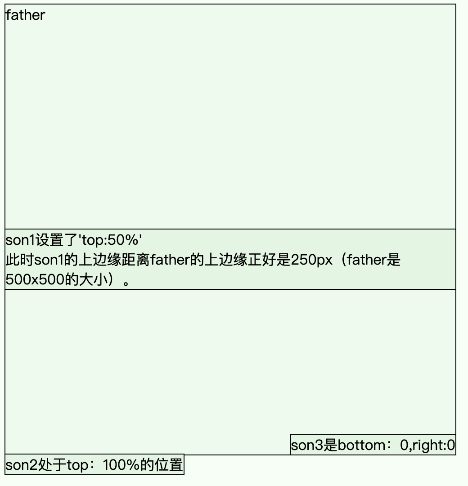

### 细致辨析absolute
这个是设置position前的默认状态，子元素和父元素会这样一直顺着浏览器往下堆。
![[src/img/Pasted image 20220120192839.png]]

.son设置position:absolute后，他们全都会拔地而起，堆到father直接下面的位置。
由于1和2在同一个位置，所以1被遮盖了。
![[src/img/Pasted image 20220120193056.png]]
这时，如果对son1设置top：0，则代表son1的顶部距离【父容器】的顶部是0。变成下面这样。

![[src/img/Pasted image 20220120193356.png]]
“啊咧？为啥不是和father贴边呢？”
——这是因为，father还没有设置position。
absolute的一个重要细节是：它所作为基准的位置，是“①最靠近自己的、②position不为static的父级”。
如果，对father设置了position:relative。son1就会乖乖贴到father的顶部。
![[src/img/Pasted image 20220120193753.png]]
由于relative相当于“自己的正常位置”，所以father设置了也不会有什么改变。
但是如果把father设置成absolute。father就也脱离了文档流，不会撑满整行了↓。
![[src/img/Pasted image 20220120194116.png]]
如果把father的位置进行移动(margin-top:30px;)，那么子元素也会跟着往下移动。
![[src/img/Pasted image 20220120194538.png]]
如果father之后添加一个同级的div“路人”，路人div会出现在文档流的正常位置——目前的正常位置就是从上往下的第一个位置——因为现有的所有其他div都脱离了文档流。
![[src/img/Pasted image 20220120194741.png]]

# 关于父子的变形
父级进行什么变化，同样会影响到子集。
对father进行scale(2)，son也会被一起放大。就像ai里打组了一样。

# 关于元素的width
主要需要关注的是width:100%的情况

比方说，father设置了 width 100%,但是却超过了视窗。
是因为father也是相对于它的父级来计算自己的width值。
这个情况下，就是 father.width =  body.width*100%

![[src/img/Pasted image 20220120214313.png]]

然而，body默认有8px的边距，所以father就算是absolute脱离了文档流，也是落到了自己的父级 —— body的位置的“左下方”，就像son落在father的左下方一样。
![[src/img/Pasted image 20220120215635.png]]

# 关于absolute的位置百分比。
一切都是父级的长宽为基数，再乘以百分比。
注意，如果父级设定了position但没有指定高度，那么设置top:50%，就相当于`0*50%`，元素就会跑到父级所在的那条线上（高度=0）。

